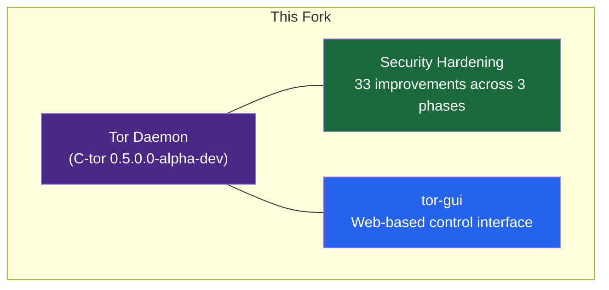
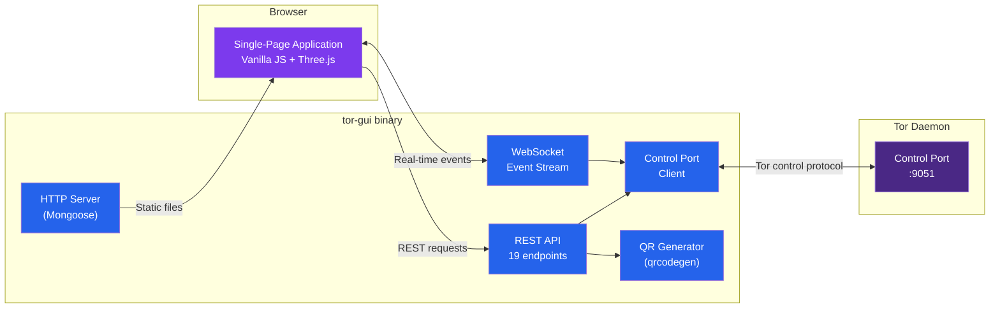
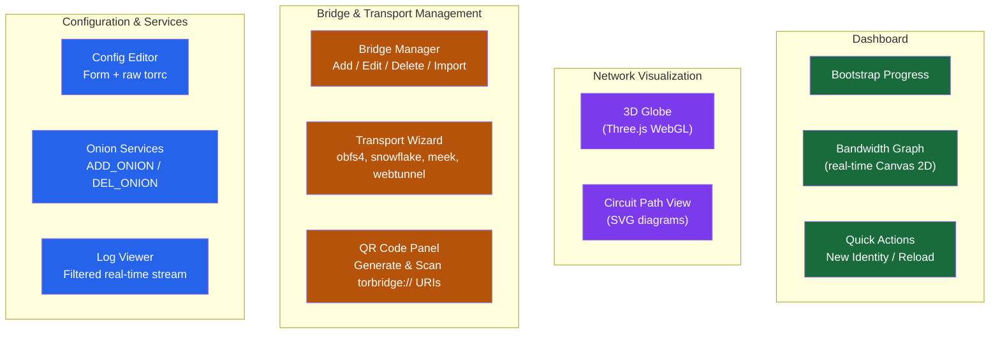
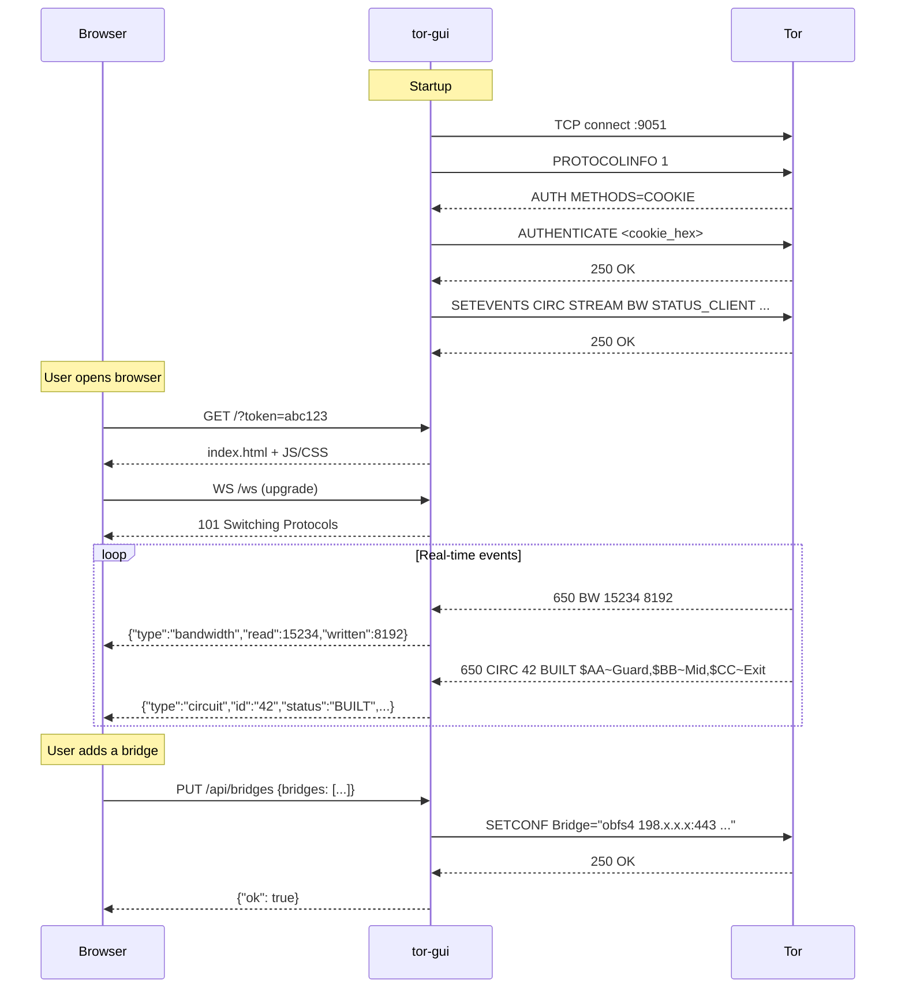
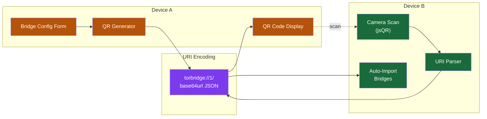
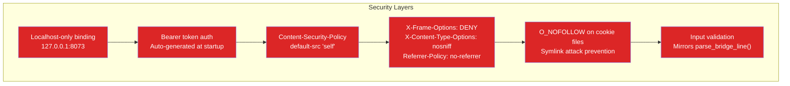

Tor protects your privacy on the internet by hiding the connection between
your Internet address and the services you use. We believe Tor is reasonably
secure, but please ensure you read the instructions and configure it properly.

This fork includes **security hardening**, **robustness improvements**, and a
**web-based GUI** (`tor-gui`) for configuration and monitoring.

## Overview



### Security Hardening (33 improvements)

| Phase | Focus | Examples |
|-------|-------|---------|
| **Phase 1** (1-6) | Build & crypto | FORTIFY_SOURCE=3, memwipe-before-free, O_NOFOLLOW, fsync |
| **Phase 2** (7-18) | Robustness | Handshake timeout, guard retry jitter, fork RNG reseed, DoS detection |
| **Phase 3** (19-33) | Platform & UX | Division-by-zero guards, actionable error messages, FreeBSD clock, heartbeat diagnostics |

---

## tor-gui: Web-Based Tor GUI

A standalone binary that provides a browser-based interface for configuring
and monitoring Tor. It connects to Tor's control port as a client (like Nyx
or Tor Browser) and requires **no modifications** to the Tor daemon itself.

### Architecture



### Feature Map



### Data Flow



### QR Code Bridge Sharing



### REST API

| Method | Endpoint | Description |
|--------|----------|-------------|
| GET | `/api/status` | Bootstrap phase, version, PID |
| GET | `/api/bandwidth` | 5-minute bandwidth history |
| GET | `/api/circuits` | Active circuit paths and status |
| GET | `/api/streams` | Active stream connections |
| GET | `/api/guards` | Entry guard list and status |
| GET | `/api/config/:key` | Read a torrc configuration key |
| PUT | `/api/config/:key` | Set a torrc configuration key |
| POST | `/api/config/load` | Load full config (LOADCONF) |
| POST | `/api/config/save` | Persist config to disk (SAVECONF) |
| POST | `/api/config/reload` | Reload config (SIGNAL RELOAD) |
| GET | `/api/bridges` | Current bridge lines |
| PUT | `/api/bridges` | Set bridges atomically |
| GET | `/api/transports` | Pluggable transport config |
| PUT | `/api/transports` | Set pluggable transports |
| POST | `/api/onion` | Create onion service (ADD_ONION) |
| DELETE | `/api/onion/:id` | Remove onion service (DEL_ONION) |
| POST | `/api/signal/:name` | Send signal (NEWNYM, RELOAD, etc.) |
| GET | `/api/qr?data=...` | Generate QR code PNG |
| GET | `/api/geoip/:ip` | GeoIP country lookup |

WebSocket endpoint: `ws://127.0.0.1:8073/ws` broadcasts real-time Tor events
(bandwidth, circuits, streams, bootstrap progress, config changes) as JSON.

### Security Model



### Source Layout

```
src/tools/tor-gui/
├── tor_gui.c              Main entry, CLI parsing, startup
├── tg_control.c/.h        Tor control port TCP client + async reader thread
├── tg_http.c/.h           Embedded HTTP/WebSocket server (Mongoose)
├── tg_api.c/.h            19 REST API endpoint handlers
├── tg_events.c/.h         Control port event → JSON → WebSocket broadcast
├── tg_config.c/.h         Bridge/PT config parsing, torbridge:// URIs
├── tg_qr.c/.h             QR code → PNG (no zlib dependency)
├── tg_json.c/.h           JSON builder + parser
├── tg_util.c/.h           Platform abstraction (sockets, threads, buffers)
├── include.am             Automake build rules
├── vendor/
│   ├── mongoose.c/.h      Embedded HTTP server (MIT)
│   └── qrcodegen.c/.h     QR code generator (MIT)
└── static/
    ├── index.html          SPA shell
    ├── css/                Styles + dark theme
    ├── js/                 11 frontend modules
    └── lib/                Three.js, jsQR stubs
```

---

## Build

To build Tor from source:

```
./configure
make
make install
```

To build Tor from a just-cloned git repository:

```
./autogen.sh
./configure
make
make install
```

To also build tor-gui:

```
./autogen.sh
./configure --enable-gui
make
```

The `tor-gui` binary will be at `src/tools/tor-gui/tor-gui`. Run it with:

```
tor-gui [--control-port HOST:PORT] [--listen ADDR:PORT] [--webroot PATH]
        [--control-password PASS] [--control-cookie PATH]
        [--no-browser] [--log-level debug|info|warn|error]
```

tor-gui is a fully standalone binary with **no Tor library dependencies**.
It communicates with Tor solely through the control port protocol.

## Releases

The tarballs, checksums and signatures can be found here: https://dist.torproject.org

- Checksum: `<tarball-name>.sha256sum`
- Signatures: `<tarball-name>.sha256sum.asc`

### Schedule

You can find our release schedule here:

- https://gitlab.torproject.org/tpo/core/team/-/wikis/NetworkTeam/CoreTorReleases

### Keys that CAN sign a release

The following keys are the maintainers of this repository. One or many of
these keys can sign the releases, do NOT expect them all:

- Alexander Faerøy:
    [514102454D0A87DB0767A1EBBE6A0531C18A9179](https://keys.openpgp.org/vks/v1/by-fingerprint/1C1BC007A9F607AA8152C040BEA7B180B1491921)
- David Goulet:
    [B74417EDDF22AC9F9E90F49142E86A2A11F48D36](https://keys.openpgp.org/vks/v1/by-fingerprint/B74417EDDF22AC9F9E90F49142E86A2A11F48D36)
- Nick Mathewson:
    [2133BC600AB133E1D826D173FE43009C4607B1FB](https://keys.openpgp.org/vks/v1/by-fingerprint/2133BC600AB133E1D826D173FE43009C4607B1FB)

## Development

See our hacking documentation in [doc/HACKING/](./doc/HACKING).

## Resources

Home page:

- https://www.torproject.org/

Download new versions:

- https://www.torproject.org/download/tor

How to verify Tor source:

- https://support.torproject.org/little-t-tor/

Documentation and Frequently Asked Questions:

- https://support.torproject.org/

How to run a Tor relay:

- https://community.torproject.org/relay/
